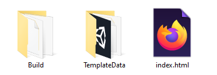

## Building a Unity project with WebGL

To build a project using WebGL, make sure that WebGL has been selected in the build setting.

Click on **File** and then **Build Settings**.

Make sure that **WebGL** is selected.

Click on the **Build And Run** button, then choose where you want to save your built project. This will take a few minutes on your first run, but will be quicker on following builds.

You game should automatically open in your default web browser, and be playable.

In the location where you chose to save your project you should see an `index.html` file, a `Build` directory and a `Template` directory.

Although your `index.html` file contains the player for your game, it will not run without using a webserver. The webserver was provided by Unity when you clicked **Build and Run**.