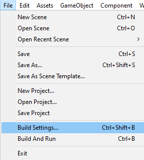
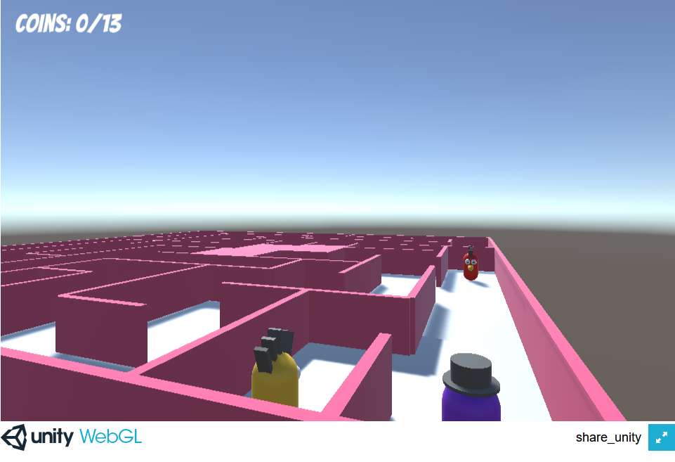

Para construir un proyecto usando WebGL, asegúrese de que WebGL ha sido seleccionado en la configuración de construcción.

Haz clic en **Archivo** y luego en **Configuración de construcción**.

Asegúrate de que **WebGL** esté seleccionado, luego haga clic en el botón **Construir y ejecutar**, y luego elija dónde desea guardar su proyecto construido. Esto tomará unos minutos en tu primera ejecución, pero será más rápido en las siguientes compilaciones.

**Consejo:** Si acaba de configurar la configuración de compilación de WebGL, deberá hacer clic en el botón **Cambiar** antes de ver el botón **Construir y Ejecutar**.

Tu juego debería abrirse automáticamente en tu navegador web predeterminado y ser jugable.

En la ubicación donde elegiste guardar tu proyecto, deberías ver un archivo `index.html`, un directorio `Build` y un directorio `Template`.

Aunque tu archivo `index.html` contiene al jugador para tu juego, no se ejecutará sin usar un servidor web. El servidor web fue proporcionado por Unity cuando haces clic en **Construir y Ejecutar**.
