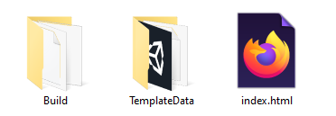

Pour créer un projet utilisant WebGL, assure-toi que WebGL a été sélectionné dans build settings.

Clique sur **File** puis sur **Build Settings**.

Assure-toi que **WebGL** est sélectionné, puis clique sur le bouton **Build And Run**, puis choisis l'endroit où tu veux enregistrer ton projet créé. Cela prendra quelques minutes lors de ton premier passage, mais sera plus rapide lors des builds suivants.

**Astuce :** Si tu viens de configurer tes paramètres de construction WebGL, tu devras cliquer sur le bouton **Switch** avant de voir le bouton **Build and Run**.

Ton jeu devrait s'ouvrir automatiquement dans ton navigateur web par défaut, et être jouable.

À l'endroit où tu as choisi d'enregistrer ton projet, tu devrais voir un fichier `index.html`, un répertoire `Build` et un répertoire `Template`.

Bien que ton fichier `index.html` contienne le joueur de ton jeu, il ne fonctionnera pas sans l'utilisation d'un serveur web. Le serveur web a été fourni par Unity lorsque tu as cliqué sur **Build and Run**.
